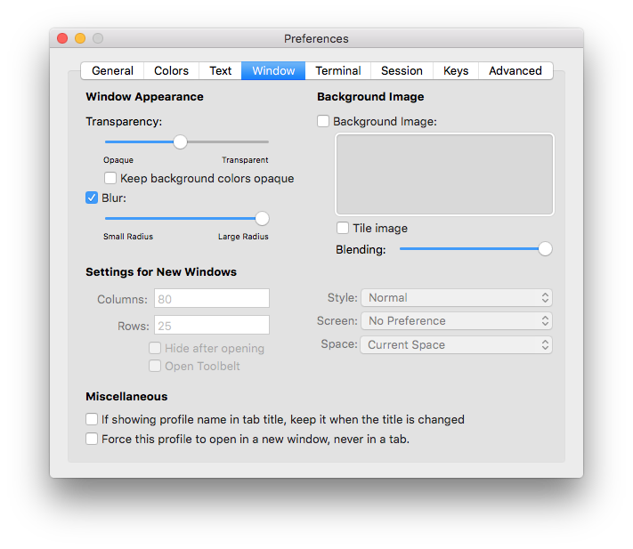

# cliTerm2

# NOTE

This project is under active development. The end goal is to have a nice way to quickly customize aspects of your iTerm2 instance right from the command line you're already using. This is a personal project so expect updates to be sporadic. Hit me with a PR or issues ticket if you would like.

# Features

* Right now all this does is fetch a random submission from the subreddit of your choice and sets it as your terminal background. Try it with `cliTerm2 earthporn` or `cliTerm2 minimalwallpaper`.

# How to Install

1. Make sure you have [Python 3.5](https://www.python.org/downloads/mac-osx/) or higher.
2. Make sure you have [iTerm2](http://www.iterm2.com/downloads.html).
3. Copy and paste the following for the installation (you can use .zshrc instead of .bash_profile if that's your thing):
    ```
    # cliTerm2 Installation
    git clone https://github.com/Nick-Gottschlich/cliTerm2 $HOME/.cliTerm2
    echo PATH="$HOME/.cliTerm2:${PATH}" >> ~/.bash_profile
    source ~/.bash_profile
    ```
4. Now you can change the terminal background like so:
    ```
    $ cliTerm2 earthporn
    ```

# Usage

```
Usage:
    cliTerm2 [parameter]

Parameters:
    cliTerm2 [subreddit]   -   Grab a random image from 'subreddit', and make it your terminal background.
    cliTerm2 help          -   Display this help message.
```

# Suggestions

Making the font colors black and the terminal window transparent will help make everything look better when you change your terminal's background. Since *cliTerm2* only changes the background, the transparency must be done manually:

1. Navigate to iTerm2 > Preferenes > Profiles > colors
2. Pick `Dark Background` from the color presets.
3. Navigate to iTerm2 > Preferences > Profiles > Window
4. Set the transparency to about 1/8 to 1/4.
5. Hit the "blur" checkbox.
6. Set the blur to maximum.
7. Optionally you can set the blending to maximum.



# Solutions for Issues

If you experience a line at the top of the terminal after changing the background, you can remove it by typing in the *clear* command or opening a new terminal.

# Notes & Credits

- This project would not exist if not for the excellent [Pokemon-Terminal](https://github.com/LazoCoder/Pokemon-Terminal) project by LazoCoder. I forked their work as an way to begin making what I wanted to create, and would be totally lost without it.
